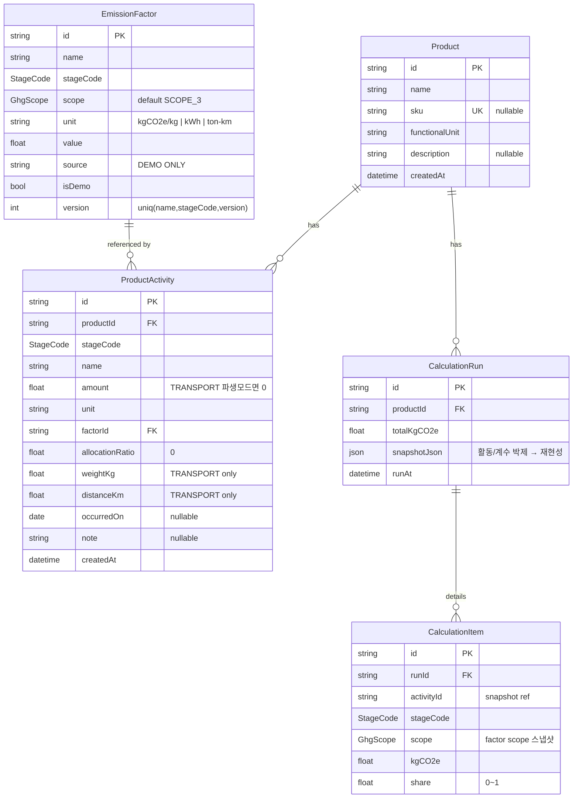

# carbon-management-platform

(주)하나루프 SaaS 탄소경영플랫폼 — **개발자 채용 과제** 구현물.

제품 단위의 **PCF(Product Carbon Footprint)** 계산을 핵심 시나리오로 잡고, 활동 데이터(BOM/공정/물류/사용/폐기) 입력 → 배출계수 매칭 → 단계별 배출량 계산·집계 → 이력 저장·시각화의 한 사이클을 동작 가능한 수준으로 구현했다.

> ⚠️ **데모용 배출계수.** 본 저장소의 `EmissionFactor.value`는 *시연용* 합성 값이며 인증/공시 용도로 사용할 수 없다 (모든 시드 계수 `isDemo = true`, `source = "DEMO ONLY — not for certification"`).

---

## 1. 개요

- **도메인 한 줄**: 제품 1단위(`functionalUnit`)당 라이프사이클 5단계의 활동량과 배출계수를 곱해 `kgCO2e`로 환산한 뒤, 단계별/제품별로 집계하고 이력으로 박제하는 시스템.
- **핵심 시나리오** (Demo Flow, 과제 제공 자료 `CT-045` 기준):
  1. 제품 등록 — `컴퓨터 화면` (sku `CT-045`, 단위 `1 unit`)
  2. 자료 표 30행 그대로 활동 등록 — 전기 9 (USE, 한국전력 0.456 kgCO2e/kWh) · 원소재 플라스틱1 9 (RAW_MATERIAL, 2.3) · 원소재 플라스틱2 3 (RAW_MATERIAL, 3.2) · 운송 트럭 9 (TRANSPORT, 3.5 kgCO2e/ton-km, `amount` 직접입력)
  3. `POST /api/products/:id/calculate` 호출 → `CalculationRun` + `CalculationItem[]` 30행 저장
  4. 대시보드에서 단계별 비중(파이) + 이력(라인) 확인 → **총 11,072.724 kgCO2e** (전기 469.224 + 플라1 7,327.8 + 플라2 339.2 + 운송 2,936.5, 수기 합산과 일치)
- **범위에서 의식적으로 제외한 것**은 §8 비-목표 참조.

## 2. 도메인 모델 — PCF & GHG Scope 매핑

### 2.1 라이프사이클 5단계

`src/domain/pcf/stages.ts`의 단일 소스. 단계 코드는 enum + 상수 튜플 + Set 세 형태로 제공돼 Zod / Prisma / 서버 가드에서 동일 정의를 공유한다.

| `StageCode`    | 의미      | 일반적 GHG Protocol Scope 3 매핑 (Corporate Value Chain) |
| -------------- | --------- | -------------------------------------------------------- |
| `RAW_MATERIAL` | 원자재    | Category 1 — Purchased goods & services                  |
| `PRODUCTION`   | 생산 공정 | Scope 1·2 (자체 운영) 또는 Cat. 1 (위탁 생산)            |
| `TRANSPORT`    | 물류      | Category 4 — Upstream transportation & distribution      |
| `USE`          | 사용 단계 | Category 11 — Use of sold products                       |
| `END_OF_LIFE`  | 폐기      | Category 12 — End-of-life treatment of sold products     |

> 본 프로젝트는 **제품 단위(PCF)** 관점만 다루며, 조직 단위 인벤토리(Scope 1/2/3 합산 리포트)는 비-목표다. 매핑은 활동이 어떤 카테고리에 위치하는지를 평가자에게 표면화하기 위한 안내일 뿐, 자동 분류 로직은 없다.

### 2.2 계산 공식 (`src/domain/pcf/calculate.ts`)

```
일반 단계 :  kgCO2e = amount × factor.value × allocationRatio
TRANSPORT :  tonKm  = (weightKg / 1000) × distanceKm
              kgCO2e = tonKm × factor.value × allocationRatio
total     :  Σ item.kgCO2e         // 부동소수 누적 오차 회피 위해 합으로 재계산
share     :  item.kgCO2e / total   // total=0 이면 0
```

도메인 가드레일: factor 누락 / 단계 불일치 / `allocationRatio ∉ (0,1]` / `amount<=0` (TRANSPORT 제외) / TRANSPORT `weightKg|distanceKm` 누락 → `PcfDomainError(code, message)` throw. 라우트 레이어는 `code` 를 그대로 전파하며 400으로 변환한다.

### 2.3 영속 모델 (`prisma/schema.prisma`)

`Product 1—N ProductActivity N—1 EmissionFactor` + `Product 1—N CalculationRun 1—N CalculationItem`.



> `StageCode` = `{ RAW_MATERIAL · PRODUCTION · TRANSPORT · USE · END_OF_LIFE }`,
> `GhgScope` = `{ SCOPE_1 · SCOPE_2 · SCOPE_3 }` (enum, 별도 테이블 없음).
> `LifeCycleStage` 메타는 `src/domain/pcf/stages.ts` 단일 소스로 관리.

설계 결정 4가지:

- **`EmissionFactor @@unique([name, stageCode])`** — 시드/대량 등록을 멱등하게 만들고 “같은 단계 안에서 동일 이름 계수가 두 벌” 인 모호함을 차단.
- **`CalculationRun.snapshotJson`** — 계산 시점의 활동/계수를 JSON으로 박제. 이후 계수가 갱신돼도 과거 run은 **재현 가능**.
- **`CalculationRun → items` nested create 1회** — 총량과 명세를 단일 prisma 호출로 묶어 일관성 확보.
- **TRANSPORT 활동만 `weightKg`/`distanceKm` 사용** — 다른 단계에서는 null 강제(Zod). 운송에서는 `amount=0` 허용(`ton-km`은 `weight×distance` 파생이므로 `amount` 미사용).

## 3. 아키텍처

```
src/
├─ app/
│  ├─ api/                     # Route Handlers (얇은 HTTP 레이어)
│  │  ├─ products/             # CRUD + calculate + calculation-runs
│  │  ├─ emission-factors/     # 계수 조회 (?stage= 필터)
│  │  └─ lifecycle-stages/     # 단계 메타 (UI 셀렉터용)
│  └─ (ui)/                    # 대시보드/입력 UI 트리
├─ domain/pcf/                 # 순수 도메인 — React/Prisma/fetch 의존 없음
│  ├─ calculate.ts             # 계산 엔진
│  ├─ summarize.ts             # 단계별 집계
│  ├─ stages.ts                # 단계 상수 단일 소스
│  └─ types.ts                 # 도메인 타입 (Prisma 모델과 분리)
├─ lib/
│  ├─ adapters/pcf.ts          # Prisma row ↔ 도메인 객체 어댑터
│  ├─ api/
│  │  ├─ response.ts           # ok / fail / failFromZod (envelope)
│  │  └─ handlers.ts           # parseJsonBody / requireProduct / validateFactorForStage
│  ├─ validations/             # Zod 입력 스키마 (product, activity)
│  ├─ db.ts                    # Prisma 7 driver-adapter 싱글톤
│  └─ http.ts                  # 클라이언트용 apiFetch + ApiClientError
└─ generated/prisma/           # Prisma Client (gitignored)
```

레이어 규칙:

1. **`domain/`은 무의존**. fetch/React/Prisma import 금지. 단위 테스트는 외부 mock 0개로 통과.
2. **`app/api/`는 얇다**. 검증 → DB → 도메인 함수 호출 → envelope 응답. 계산식은 한 줄도 없다.
3. **응답 봉투는 단 하나** — `{ data } | { error: { message, code?, fields? } }`. 클라이언트(`apiFetch`)는 이 모양 외에는 알지 못한다.
4. **에러 코드는 식별자**. 사용자용 한글 메시지와 분리해 클라이언트 분기에 사용한다.

## 4. API 명세

기본 URL: `http://localhost:3000/api`. 모든 응답은 envelope.

| Method | Path                                   | 설명                                                   | 주요 에러 코드                                                                                                  |
| ------ | -------------------------------------- | ------------------------------------------------------ | --------------------------------------------------------------------------------------------------------------- |
| GET    | `/products`                            | 제품 목록 (활동 수 / 마지막 run 포함)                  | `INTERNAL_ERROR`                                                                                                |
| POST   | `/products`                            | 제품 생성 `{name, sku?, functionalUnit, description?}` | `INVALID_JSON`, `VALIDATION_ERROR`, `SKU_CONFLICT`                                                              |
| GET    | `/products/:id`                        | 제품 단건 (활동 + 마지막 run)                          | `INVALID_PRODUCT_ID`, `PRODUCT_NOT_FOUND`                                                                       |
| POST   | `/products/:id/activities`             | 활동 추가                                              | `INVALID_JSON`, `VALIDATION_ERROR`, `PRODUCT_NOT_FOUND`, `FACTOR_NOT_FOUND`, `FACTOR_STAGE_MISMATCH`            |
| POST   | `/products/:id/activities/bulk`        | 활동 일괄 임포트 (JSON 또는 `text/csv`, `?mode=append｜replace`) | `INVALID_JSON`, `VALIDATION_ERROR`, `CSV_PARSE_ERROR`, `UNSUPPORTED_MEDIA_TYPE`, `FACTOR_NOT_FOUND`, `FACTOR_STAGE_MISMATCH` |
| PUT    | `/activities/:id`                      | 활동 수정                                              | `INVALID_ACTIVITY_ID`, `VALIDATION_ERROR`, `FACTOR_NOT_FOUND`, `FACTOR_STAGE_MISMATCH`, `ACTIVITY_NOT_FOUND`    |
| DELETE | `/activities/:id`                      | 활동 삭제                                              | `INVALID_ACTIVITY_ID`, `ACTIVITY_NOT_FOUND`                                                                     |
| POST   | `/products/:id/calculate`              | PCF 계산 + `CalculationRun` 저장                       | `PRODUCT_NOT_FOUND`, `NO_ACTIVITIES`, `FACTOR_MISMATCH`, `FACTOR_STAGE_MISMATCH`, `NEGATIVE_AMOUNT`, `INVALID_ALLOCATION`, `INVALID_TRANSPORT` |
| GET    | `/products/:id/calculation-runs`       | 계산 이력 (`?include=items`로 명세 포함)               | `PRODUCT_NOT_FOUND`, `INTERNAL_ERROR`                                                                           |
| GET    | `/emission-factors`                    | 배출계수 목록 (`?stage=PRODUCTION` 필터)               | `INVALID_STAGE`, `INTERNAL_ERROR`                                                                               |
| GET    | `/lifecycle-stages`                    | 단계 메타 (UI 셀렉터)                                  | —                                                                                                               |
| GET    | `/health`                              | 프로세스 + DB 상태 (`SELECT 1` ping)                       | `INTERNAL_ERROR` (503, DB 연결 실패 시)                                                                       |

전체 에러 코드 카탈로그는 [src/lib/api/error-codes.ts](src/lib/api/error-codes.ts)에 단일 정의로 모아 두었다. 라우트는 반드시 `API_ERROR_CODES.X`를 통해 `code` 를 부여한다.

응답 봉투 예:

```jsonc
// 성공
{ "data": { "id": "cmp...", "totalKgCO2e": 142.37, "items": [/* ... */] } }

// 실패
{ "error": { "message": "활동이 참조한 배출계수의 단계가 일치하지 않습니다.",
             "code": "FACTOR_STAGE_MISMATCH" } }

// 검증 실패
{ "error": { "message": "입력값이 올바르지 않습니다.",
             "code": "VALIDATION_ERROR",
             "fields": { "amount": ["0보다 커야 합니다"] } } }
```

## 5. 실행 (Getting Started)

### 5.1 요구사항

- Node.js ≥ 20 (`.nvmrc` 22.18.0 권장)
- npm 10.x
- Docker (Postgres 16)

### 5.2 부트스트랩

```bash
# 1) 의존성
npm ci

# 2) 환경변수
cp .env.example .env       # DATABASE_URL 기본값 사용

# 3) Postgres 기동
docker compose up -d

# 4) 마이그레이션 + 시드 (멱등)
npx prisma migrate dev     # 스키마 적용
npm run db:seed            # 제품 1 + 계수 4 + 활동 30 upsert (CT-045 컴퓨터 화면 시드)

# 5) 개발 서버
npm run dev                # http://localhost:3000
```

> **패키지 매니저**: 본 저장소는 `package-lock.json` 기준 **npm** (`npm@10.9.3`) 으로 검증됐다. 평가자가 yarn 을 선호하면 동일 단계의 등가 명령으로 대체 가능:
>
> ```bash
> yarn install                  # npm ci 대체
> yarn dev                      # npm run dev 대체
> yarn build && yarn start      # 프로덕션 기동 (next start 는 build 산출물 필요)
> yarn test                     # npm test 대체 (= vitest run)
> ```
>
> 자가 체크리스트의 "`yarn start` 로 오류 없이 실행" 항목은 `yarn build` 선행 후 만족된다 (`scripts.start = "next start"` 이므로 build 산출물이 있어야 한다).

### 5.3 빠른 검증 (curl)

```bash
# 제품 목록
curl -s localhost:3000/api/products | jq

# 계산 실행 (CT-045 = 시드된 "컴퓨터 화면")
PID=$(curl -s localhost:3000/api/products | jq -r '.data[] | select(.sku=="CT-045") | .id')
curl -s -X POST localhost:3000/api/products/$PID/calculate | jq
#   → totalKgCO2e: 11072.724 (자료 표 수기 합산과 일치)

# 자료 CSV 일괄 임포트 — mode=replace는 멱등 재임포트
curl -s -X POST "localhost:3000/api/products/$PID/activities/bulk?mode=replace" \
  -H "Content-Type: text/csv" --data-binary @docs/sample-ct045.csv | jq
#   → {"data":{"inserted":30,"mode":"replace","productId":"..."}}

# 이력
curl -s "localhost:3000/api/products/$PID/calculation-runs?include=items" | jq

# 헬스체크 (프로세스 + DB ping)
curl -s localhost:3000/api/health | jq
```

### 5.4 프론트엔드 데모 흐름 (UI 5단계)

평가자 시연용 — 브라우저에서 한 사이클을 그대로 재현한다.

1. **시드** — `npm run db:seed` 로 `CT-045 컴퓨터 화면` + 활동 30행을 멱등 적재.
2. **목록 진입** — `npm run dev` 후 [http://localhost:3000](http://localhost:3000) 에서 `CT-045` 카드 클릭 → 상세 진입.
3. **계산 실행** — 상세 헤더의 `계산 실행` 버튼 → `LatestRunSummary` 가 **11,072.724 kgCO2e** 와 단계별 비중을 표시, 대시보드 5종(KPI/Scope 도넛/단계 도넛·막대/이력 라인/TopN)이 즉시 갱신.
4. **CSV 재임포트** — `CSV 임포트` 탭 → `docs/sample-ct045.csv` 선택 + `mode=replace` → 30행 멱등 재시연 후 다시 계산 실행해도 동일 총량 재현.
5. **이력 확인** — `계산 이력` 탭에서 누적 run 의 총량/단계별 비중 추이를 확인. URL `?tab=runs|csv` 로 탭이 영속되며 새로고침/공유 가능.

> 모든 차트는 `role="img"` + SR 전용 `<table>` 로 스크린리더 동등 표현을 제공하며, `Tab` 키 만으로 헤더 → 본문 건너뛰기 링크 → 폼/탭 순회가 가능하다.

### 5.5 과제 원본 Excel 임포트 (xlsx 직접 또는 CSV 경유)

과제 안내 이미지의 30행 활동 표는 **두 경로** 로 적재 가능하다.

**(권장) xlsx 직접 업로드** — 가공 없이 원본 `.xlsx` 그대로:

1. UI `CSV / Excel 임포트` 탭에서 원본 Excel 파일을 드래그 → `mode=replace` → "Excel 업로드".
2. 서버가 [src/lib/csv/xlsx-to-rows.ts](src/lib/csv/xlsx-to-rows.ts) 로 첫 시트를 CSV 로 변환 후 동일 파이프라인으로 적재.
3. curl 사용 시:
   ```bash
   curl -X POST "localhost:3000/api/products/$PID/activities/bulk?mode=replace" \
     -H "Content-Type: application/vnd.openxmlformats-officedocument.spreadsheetml.sheet" \
     --data-binary @CT-045.xlsx | jq
   ```

**(폴백) CSV 변환 경로** — xlsx 라이브러리 없는 환경/스크립트용:

1. Excel 시트를 **다른 이름으로 저장 → CSV UTF-8 (`.csv`)** 로 내보낸다. 헤더는 `일자,활동 유형,설명,량,단위` (저장소의 [docs/sample-ct045.csv](docs/sample-ct045.csv) 와 동일 스키마).
2. UI 또는 §5.3 의 `Content-Type: text/csv` curl 예시로 업로드 → `mode=replace`.

> 두 경로 모두 30행 적재 후 "계산 실행" → **11,072.724 kgCO2e** 가 재현된다. 헤더 매핑·계수 해석은 [src/lib/csv/activity-csv.ts](src/lib/csv/activity-csv.ts) 가 단일 소스 (외부 CSV 파서 미사용) — 한국어 헤더와 활동 유형(`전기/원소재/운송`) + 설명(`플라스틱 1|2`) 기반으로 시드 4종 factor 와 매칭한다.

## 6. 테스트

```bash
npm test          # vitest run (단위 42건)
npm run test:watch
```

| 영역            | 파일                                      | 커버                                       |
| --------------- | ----------------------------------------- | ------------------------------------------ |
| 계산 엔진       | `src/domain/pcf/__tests__/calculate.test` | 일반/TRANSPORT/배분비/가드 15건            |
| Zod (activity)  | `src/lib/validations/__tests__`           | 단계별 필수/금지 필드 8건                  |
| Zod (product)   | `src/lib/validations/__tests__`           | name/sku/functionalUnit 4건                |
| HTTP 클라이언트 | `src/lib/__tests__/http.test`             | 봉투 풀이 / 에러 전파 / JSON 파싱 실패 3건 |

도메인 테스트는 mock 0개 — `src/domain/`이 외부 의존을 갖지 않기에 가능한 구조다.

## 7. 설계 결정 & Trade-off

| 결정                                          | 대안                  | 채택 이유                                                                          |
| --------------------------------------------- | --------------------- | ---------------------------------------------------------------------------------- |
| `domain/`과 `app/api/` 강제 분리              | 라우트에 계산식 인라인 | 도메인 단위 테스트 가능 + 백오피스/CLI에서 재사용 여지                              |
| envelope `{data｜error}` 단일화               | 200/4xx body 자유     | 클라이언트 단일 분기, 에러 코드 표면화                                              |
| `CalculationRun.snapshotJson` 박제            | run에 factorId만 저장 | 계수 갱신 후에도 과거 PCF 재현 가능 (감사 추적성)                                    |
| `EmissionFactor @@unique([name, stageCode])`  | 자유 중복             | 시드/재실행 멱등성 + 같은 단계 내 모호성 제거                                       |
| Prisma 7 driver-adapter (`@prisma/adapter-pg`) | 기본 엔진             | 서버리스/엣지 친화 + 추후 다른 어댑터 교체 용이                                     |
| TRANSPORT `amount=0` 허용                     | 항상 >0               | `ton-km`은 `weight×distance` 파생, `amount` 미사용                                  |
| 한글 메시지 + 영문 `code`                     | 한쪽 단일             | UX(한글) ↔ 식별자(영문) 책임 분리                                                  |

알려진 한계: ① 다중 사용자/권한 없음 ② 통화/환산/검증 워크플로 없음 ③ 계산 시점 동시성은 단일 트랜잭션 미적용.

## 8. 비-목표 (Non-goals)

- 조직 단위(Scope 1·2·3) 인벤토리 리포트
- 인증급 LCI/LCA 데이터셋 연동 (ecoinvent, GaBi 등)
- 인증·공시 워크플로 (검증인·서명·감사 로그)
- 인증(SSO/RBAC), 멀티 테넌시
- 배출계수 출처 메타데이터 (year/region/method) — 현 스키마에는 `source` 텍스트만 있음
- 실시간 협업, 알림, 워크플로 자동화

이 항목들은 의도적으로 잘라낸 범위이며, 데이터 모델을 단순화해 평가 시연 동선을 분명히 하기 위한 결정이다.

## 9. AI 도구 사용 내역

본 과제는 AI 사용이 허용됐으며, 사용 기록은 [docs/AI_USAGE.md](docs/AI_USAGE.md) 에 **"무엇을 했는지 / 어떤 Prompt 를 썼는지 / 왜 그렇게 결정했는지"** 3원칙으로 기록했다. AI 는 보조 도구로 사용했고, 최종 판단과 검증은 본인이 직접 수행했다.

사용 도구는 **ChatGPT** (요구사항 분석 · PCF 도메인 이해 · 벤치마킹 · 문서 초안), **Figma AI** (제품 목록/상세 대시보드 초기 프로토타입), **GitHub Copilot Chat** (코드 구현 보조 · 리팩터 · 테스트 케이스 초안) 3종이다.

| 사용 영역 | 사용 도구 | Prompt 요약 | 반영 내용 | 검증 방식 |
| --- | --- | --- | --- | --- |
| 요구사항 분석 | ChatGPT | "과제 안내 기준 필수/제외 항목 구분" | P0 항목만 본 저장소에 구현 · 우선순위는 본인 재배열 | 과제 첨부 이미지 3종과 1:1 대조 |
| PCF 도메인 | ChatGPT | "Scope 1·2·3 vs 생애주기 5단계 차이 설명" | 생애주기 단계별 차트와 Scope 1/2/3 차트를 분리해 구현 | 시드/`stages.ts` 단계 코드 일치 확인 (`RAW_MATERIAL / PRODUCTION / TRANSPORT / USE / END_OF_LIFE`) |
| 데이터 모델 | ChatGPT + Copilot | "Product/EmissionFactor/Activity/Run/Item 어떻게 나눌까" | snapshotJson 박제 채택 (버전 테이블 대신) | `prisma/schema.prisma` 와 실제 라우트 일치 확인 |
| 계산 로직 | ChatGPT + Copilot | "amount × factor × ratio, TRANSPORT 만 ton-km" | `src/domain/pcf/calculate.ts` 순수 함수로 분리 | vitest 19건 + 단위 차원 본인 검증 |
| UI 프로토타입 | Figma AI | "제품 목록 + 상세 대시보드 시안" | 시안 그대로 사용하지 않고 API shape · 단위 · DEMO ONLY · 5단계/Scope 요구에 맞게 재작성 | 브라우저에서 5단계 데모 완주 |
| UI/UX 설계 | ChatGPT | "비전문가도 이해 가능한 화면 구성" | 제품 목록 + 상세 (탭 3종) 로 압축 | 단위 · Empty/Loading/Error 상태 화면 확인 |
| 코드 보조 | Copilot | "props 기반 컴포넌트 리팩터" | 페이지 → 컴포넌트 props 기반 책임 분리 | `npx tsc --noEmit` · `npm run lint` 통과 |
| 테스트 | Copilot + ChatGPT | "정상/경계/실패 케이스 vitest" | 6 파일 53건 작성 | `npm test` 53/53 |
| README/문서 | ChatGPT | "평가 4축에 맞춘 섹션 순서" | 본 저장소 README 8섹션 | 실행 명령 · 파일 경로 본인 검증 |

> AI 가 제안했지만 의식적으로 제외한 항목: 로그인 · RBAC · 멀티 테넌시 · AI 자동 리포트 · 감축 시나리오 · Sankey · 공급사 포털 · "공식 배출계수" 표기. 사유는 [docs/AI_USAGE.md](docs/AI_USAGE.md) §4 참고.
