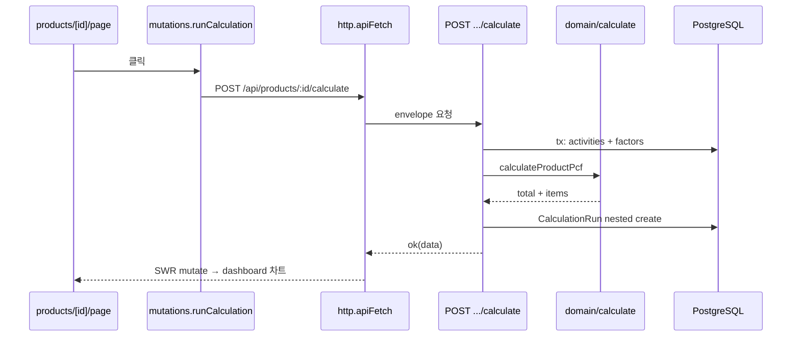

# Architecture — 상세 설계

본 문서는 [README.md](../README.md) §1~2(도메인·개요), §3(아키텍처 트리), §7(설계 결정)을 **구현 관점에서 확장**한다.  
과제 평가 기준인 *“README에 시스템 전체적인 설명과 설계 내용을 포함”* 에 맞추어, **왜 이렇게 나누었는지**와 **실제 파일이 무엇을 하는지**를 저장소 구조와 1:1로 대응시켜 기술한다.

| 문서 | 역할 |
| ---- | ---- |
| [README.md](../README.md) | 제품·도메인 한 줄 요약, PCF 공식, API 표, 실행 방법, 데모 흐름 |
| **본 문서** | 레이어·폴더·파일 책임, 설계 의도, 요청/데이터 흐름 |
| [openapi.yaml](./openapi.yaml) | HTTP 계약 (기계 판독) |
| [AI_USAGE.md](./AI_USAGE.md) | AI 보조 사용 기록 |

---

## 1. 시스템 개요

### 1.1 무엇을 만드는가

**제품 1단위 PCF(Product Carbon Footprint)** 를 계산·저장·시각화하는 **Next.js 풀스택** 애플리케이션이다.

- 사용자는 브라우저(UI)에서 제품·활동을 입력한다.
- 동일 프로세스의 Route Handler(API)가 검증·영속·계산을 수행한다.
- 결과는 PostgreSQL에 `CalculationRun` / `CalculationItem` 으로 박제되고, 대시보드 차트로 표시된다.

### 1.2 런타임 구성 (로컬)

```
┌─────────────────────────────────────────────────────────┐
│  호스트 — Node.js ≥ 20                                   │
│  npm run dev  →  Next.js 14 (localhost:3000)            │
│    ├─ app/(dashboard)/*     UI (React 18)                │
│    └─ app/api/*             REST API                     │
│         └─ lib/db.ts → Prisma 7 + adapter-pg           │
└───────────────────────────┬─────────────────────────────┘
                            │ DATABASE_URL
┌───────────────────────────▼─────────────────────────────┐
│  Docker — postgres:16-alpine (docker-compose.yml)        │
│  localhost:5432 / db=carbon / user=carbon                │
└─────────────────────────────────────────────────────────┘
```

별도 백엔드 서버(JVM, Express 단독 등)는 없다. **API와 UI가 한 Next 앱**이며, DB만 Docker로 분리한다.

### 1.3 저장소 루트 (앱 외부)

실제 클론 후 부트스트랩에 관여하는 파일만 열거한다.

```
(루트)
├─ package.json · package-lock.json   # scripts, engines (node >=20), npm@10.9.3
├─ next.config.mjs                    # Next 설정 (현재 기본값)
├─ tsconfig.json                      # @/* → src/*, strict
├─ postcss.config.mjs                 # Tailwind v4 (@tailwindcss/postcss)
├─ vitest.config.ts                   # src/**/*.{test,spec}, jsdom
├─ prisma.config.ts                   # Prisma 7 — schema·migrations·DATABASE_URL
├─ docker-compose.yml                 # Postgres 16 단일 서비스
├─ .env.example → .env (로컬)        # DATABASE_URL (gitignore)
├─ prisma/
│  ├─ schema.prisma
│  ├─ seed.ts
│  └─ migrations/                     # 5개 SQL 마이그레이션
├─ src/                               # §2 — 애플리케이션 본체
├─ docs/                              # openapi, sample CSV, 본 문서
└─ redoc-static.html                  # OpenAPI HTML 스냅샷 (선택)
```

| 파일 | 설계상 역할 |
| ---- | ----------- |
| `prisma.config.ts` | Prisma 7에서 DB URL·migration 경로를 코드로 관리 (`dotenv` 로 `.env` 로드) |
| `docker-compose.yml` | 평가자 로컬에서 DB만 reproducible 하게 기동 |
| `.env.example` | `compose` 계정·포트와 동일한 `DATABASE_URL` 템플릿 |
| `src/generated/prisma/` | `npx prisma migrate dev` 후 생성 — **gitignore**, CI/클론 시 반드시 재생성 |

`.eslintrc.json`, `.prettierrc` — 품질 도구. 런타임 아키텍처와 무관.

---

## 2. 레이어드 아키텍처 — 왜 이렇게 나누었는가

### 2.1 설계 목표

| 목표 | 수단 |
| ---- | ---- |
| PCF 계산식을 한곳에 모아 검증 가능하게 | `src/domain/pcf/*` 순수 함수 |
| HTTP·DB·UI 변경이 계산 로직을 깨지 않게 | `app/api` 는 orchestration 만 |
| 평가자·후속 개발자가 API 계약을 빠르게 파악 | envelope + `error-codes` + OpenAPI |
| 과거 계산 결과 재현 | `CalculationRun.snapshotJson` |
| 과제 데모(CT-045 30행) 멱등 재현 | `prisma/seed.ts` + CSV bulk |

### 2.2 의존 방향 (허용되는 import)

```
components  →  lib/api (hooks, mutations)  →  lib/http
     ↓              ↓
  types/api      (fetch /api/*)

app/api/*  →  lib/validations, lib/api/handlers, lib/adapters, lib/db
          →  domain/pcf  (계산·에러만)
          ↘  Prisma (lib/db)

domain/pcf  →  (없음 — React, Prisma, fetch 금지)
```

**금지 예**: `domain/pcf/calculate.ts` 에서 `@/lib/db` import — 레이어 침범.

### 2.3 README §3 레이어 규칙 (구현 매핑)

| 규칙 | 구현 위치 |
| ---- | --------- |
| domain 무의존 | `domain/pcf/__tests__` — mock 0건 |
| API 얇게 | 예: `calculate/route.ts` — `calculateProductPcf()` 호출만, 식 없음 |
| envelope 단일 | `lib/api/response.ts` `ok` / `fail` / `failFromZod` |
| code vs 한글 message | `error-codes.ts` + `error-messages.ts` + 라우트 `fail(..., { code })` |

---

## 3. `src/` 상세 구조

README §3 트리와 동일하되, **파일 단위**로 책임을 적는다.

### 3.1 `src/app/` — 라우팅·진입점

| 파일 | 역할 |
| ---- | ---- |
| `app/layout.tsx` | HTML shell, 글로벌 CSS |
| `app/providers.tsx` | `SWRConfig` + `apiFetch` 기본 fetcher |
| `app/globals.css` | Tailwind·테마 토큰 |

#### `src/app/api/` — Route Handlers

| 경로 | HTTP | 핵심 처리 |
| ---- | ---- | --------- |
| `health/route.ts` | GET | `SELECT 1` DB ping, uptime |
| `products/route.ts` | GET, POST | 목록(+집계), 제품 생성 |
| `products/[id]/route.ts` | GET | 제품·활동·factor join·lastRun |
| `products/[id]/activities/route.ts` | POST | `ActivityInput` 검증, factor 단계 일치 |
| `products/[id]/activities/bulk/route.ts` | POST | `text/csv` 또는 xlsx → `activity-csv` 파이프 |
| `products/[id]/calculate/route.ts` | POST | 트랜잭션 내 스냅샷 조회 → domain 계산 → Run 저장 |
| `products/[id]/calculation-runs/route.ts` | GET | 이력 (`?include=items`) |
| `activities/[id]/route.ts` | PUT, DELETE | 활동 수정·삭제 |
| `emission-factors/route.ts` | GET | `?stage=` 필터 |
| `lifecycle-stages/route.ts` | GET | `domain/pcf/stages` 메타 JSON |

공통 패턴: `parseJsonBody` → Zod → `requireProduct` / `validateFactorForStage` → Prisma → `ok(data)`.

#### `src/app/(dashboard)/` — UI (라우트 그룹)

괄호 폴더는 **URL에 포함되지 않는다**.

| 경로 | URL | 역할 |
| ---- | --- | ---- |
| `layout.tsx` | — | `AppHeader`, `DemoBanner`, skip-link, `max-w` 컨테이너 |
| `page.tsx` | `/` | `useProducts` + `ProductList` + `ProductForm` 다이얼로그 |
| `products/[id]/page.tsx` | `/products/:id` | 활동 CRUD, 계산 버튼, 탭(대시보드·이력·CSV), 차트 |

---

### 3.2 `src/components/` — 프레젠테이션

도메인 계산·API 호출은 하지 않고, **props / hooks 결과**만 렌더한다.

| 디렉터리 | 파일 | 역할 |
| -------- | ---- | ---- |
| **product/** | `ProductList.tsx` | 제품 카드 그리드, 상세 링크 |
| | `ProductForm.tsx` | 생성 다이얼로그 (RHF + Zod) |
| | `ProductForm.test.tsx` | 폼 검증 회귀 |
| **activity/** | `ActivityForm.tsx` | 단계별 필드·운송 분기 |
| | `ActivitiesTable.tsx` | 활동 목록·인라인 수정 트리거 |
| | `BulkImportPanel.tsx` | CSV/xlsx 업로드 UI |
| | `TransportFields.tsx` | weightKg / distanceKm / 직접 ton-km |
| **dashboard/** | `TotalPcfCard.tsx` | 총 배출 KPI |
| | `ScopeDonut.tsx` | GHG Scope 비중 |
| | `StagePieChart.tsx` · `StageBarChart.tsx` | 생애주기 단계별 |
| | `CalculationRunsHistory.tsx` | run 시계열 라인 |
| | `TopEmittersTable.tsx` | 활동 Top N |
| | `CalculationBasisNote.tsx` | 계산 기준·DEMO 안내 |
| **charts/** | `Donut.tsx` · `Bar.tsx` | recharts 공통 래퍼 |
| **common/** | `AppHeader.tsx` · `DemoBanner.tsx` · `HealthBadge.tsx` | chrome |
| | `EmptyState.tsx` · `LoadingState.tsx` · `ErrorState.tsx` | 4상태 UI |
| **ui/** | `button`, `dialog`, `input`, `textarea`, `select`, `tabs`, `label`, `radio-group`, `separator`, `skeleton`, `tooltip`, `utils` | shadcn 스타일 primitives (`forwardRef` 로 RHF 연동) |

---

### 3.3 `src/domain/pcf/` — 순수 PCF 도메인

| 파일 | 역할 |
| ---- | ---- |
| `stages.ts` | 5단계 코드·한글 라벨·순서 — **단일 진실** (Prisma enum과 1:1) |
| `scopes.ts` | GHG Scope 1/2/3 상수 |
| `types.ts` | `DomainActivity`, `DomainFactor`, 계산 결과 타입 |
| `errors.ts` | `PcfDomainError(code, message)` |
| `calculate.ts` | `calculateProductPcf`, ton-km, allocation, 가드 |
| `summarize.ts` | 단계·Scope별 집계 (차트 입력) |
| `__tests__/calculate.test.ts` | 15+ 경계 케이스 |
| `__tests__/summarize.test.ts` | 집계 검증 |

**설계 이유**: 과제 핵심인 “계산식이 맞는가”를 **프레임워크 없이** vitest로 증명. 라우트나 UI 버그와 분리된다.

---

### 3.4 `src/lib/` — 인프라·공유 로직

#### `adapters/`

| 파일 | 역할 |
| ---- | ---- |
| `pcf.ts` | Prisma row → `DomainActivity` / `DomainFactor`; `buildCalculationSnapshot` JSON |
| `dashboard.ts` | API 응답 → 차트 series (단계 순서·색상) |

**설계 이유**: Prisma 모델을 UI·도메인에 직접 노출하지 않음. 스키마 변경 시 adapter만 수정.

#### `api/`

| 파일 | 역할 |
| ---- | ---- |
| `response.ts` | `{ data } \| { error }` envelope |
| `handlers.ts` | JSON 파싱, 제품 존재, factor 단계 검증, Prisma 에러 매핑 |
| `error-codes.ts` | `API_ERROR_CODES` 단일 정의 |
| `error-messages.ts` | 클라이언트 fallback 한글 |
| `hooks.ts` | SWR: `useProducts`, `useProduct`, `useFactors`, `useRuns`, `useHealth` |
| `mutations.ts` | POST/PUT/DELETE 래퍼 (제품·활동·계산·bulk) |

#### `validations/`

| 파일 | 역할 |
| ---- | ---- |
| `product.ts` | `ProductCreateInput` — API·`ProductForm` 공유 |
| `activity.ts` | `ActivityInput` + `superRefine` (운송 XOR 등) |
| `__tests__/*.test.ts` | Zod 경계 12건 |

#### `csv/`

| 파일 | 역할 |
| ---- | ---- |
| `activity-csv.ts` | 한국어 헤더 파싱, 활동 유형→factor 매칭 |
| `xlsx-to-rows.ts` | SheetJS로 첫 시트 → CSV 동일 파이프 |
| `__tests__/` | 파서·매칭 회귀 |

#### 기타 `lib/`

| 파일 | 역할 |
| ---- | ---- |
| `db.ts` | Prisma 7 + `PrismaPg` 싱글톤 (HMR 대응) |
| `http.ts` | `apiFetch`, `ApiClientError` |
| `format.ts` | kgCO2e·비율 표시 |
| `ui/palette.ts` · `ui/cn.ts` | 차트 색·className 유틸 |

---

### 3.5 `src/types/`

| 파일 | 역할 |
| ---- | ---- |
| `api.ts` | `ProductDetail`, `Activity`, `CalculationRun`, … — **클라이언트 DTO** |
| `css.d.ts` | CSS module 타입 (보조) |

Prisma 생성 타입 대신 **라우트가 실제 반환하는 필드만** 정의 → 컴포넌트 결합도 감소.

---

### 3.6 `src/generated/prisma/`

- `schema.prisma` `output = "../src/generated/prisma"`
- migrate 후 생성, gitignore
- `lib/db.ts`, `prisma/seed.ts`, 모든 `app/api/*` 가 의존

---

## 4. `prisma/` — 영속 계층

### 4.1 모델 관계 (요약)

```
Product 1—N ProductActivity N—1 EmissionFactor
Product 1—N CalculationRun 1—N CalculationItem
```

자세한 필드·ERD는 [README §2.3](../README.md#23-영속-모델-prismaschemaprisma).

### 4.2 마이그레이션 (실제 파일)

| 디렉터리 | 내용 |
| -------- | ---- |
| `20260517153637_init` | 초기 스키마 |
| `20260518082339_add_emission_factor_unique` | 계수 unique |
| `20260518101152_add_activity_occurred_on` | 활동 일자 |
| `20260518120000_add_factor_scope_and_version` | Scope·version |
| `20260518112112_drop_unused_factor_validity` | 미사용 컬럼 제거 |

### 4.3 `seed.ts`

- SKU `CT-045` 제품 + factor 4종 + 활동 30행
- 멱등 upsert / productId 기준 활동 재삽입
- 기대 총량 **11,072.724 kgCO2e** (README 데모와 동일)

---

## 5. 주요 요청 흐름

### 5.1 PCF 계산 (핵심)



### 5.2 활동 CSV 일괄 임포트

`BulkImportPanel` → `bulkImportCsv` / `bulkImportXlsx` → `POST .../activities/bulk?mode=append|replace` → `activity-csv.ts` (또는 `xlsx-to-rows` → 동일) → Prisma `createMany` / replace 시 deleteMany 후 삽입.

### 5.3 제품 생성

`ProductForm` → `ProductCreateInput` (client Zod) → `POST /api/products` → 동일 스키마 서버 검증 → `prisma.product.create`.

---

## 6. 설계 결정 (왜 이렇게 했는가)

README §7 표를 구현 근거와 함께 정리한다.

| 결정 | 왜 | 트레이드오프 |
| ---- | -- | ------------ |
| **Next 풀스택** | 과제 범위(CRUD+계산+차트)를 한 repo·한 dev 명령으로 시연 | 대규모 팀 분리 배포에는 부적합 |
| **domain/ 분리** | 계산 19+ 테스트, 라우트 0줄 식 | 초기 보일러플레이트 증가 |
| **envelope** | `apiFetch` 한 곳에서 성공/실패 분기 | 비-JSON 레거시 API와 혼용 어려움 |
| **snapshotJson** | 계수 version 업데이트 후에도 과거 run 재현 | JSON 컬럼 쿼리·정규화 약함 |
| **factor @@unique([name, stageCode, version])** | 시드·CSV 멱등 | 동명 계수 다른 값은 version row 추가 필요 |
| **Prisma 7 adapter-pg** | 서버리스·드라이버 교체 여지 | 설정 파일(`prisma.config.ts`) 추가 |
| **TRANSPORT amount=0 허용** | ton-km = weight×distance 파생 | UI에서 모드 혼동 방지용 Zod superRefine 필요 |
| **한글 message + 영문 code** | UX + 프로그램 분기 | i18n 다국어는 비목표 |
| **(dashboard) 라우트 그룹** | 레이아웃 공유, URL 깔끔 | Next App Router 이해 필요 |
| **components/ui shadcn** | 접근성·일관된 폼 | `forwardRef` 누락 시 RHF 연동 깨짐 (Input/Textarea 적용됨) |

---

## 7. 테스트 배치

| 위치 | 건수(대략) | 목적 |
| ---- | ---------- | ---- |
| `domain/pcf/__tests__` | calculate·summarize | 핵심 공식 |
| `lib/validations/__tests__` | product·activity | 입력 계약 |
| `lib/csv/__tests__` | csv·xlsx | 임포트 파이프 |
| `lib/__tests__/http.test.ts` | 3 | envelope 풀이 |
| `components/product/ProductForm.test.tsx` | 1 | RHF+Zod 회귀 |

`npm test` → `vitest run` ([vitest.config.ts](../vitest.config.ts)).

---

## 8. 관련 문서·명령

| 목적 | 참고 |
| ---- | ---- |
| 로컬 기동 | [README §5](../README.md#5-실행-getting-started) |
| API 엔드포인트 표 | [README §4](../README.md#4-api-명세) |
| OpenAPI | [openapi.yaml](./openapi.yaml) |
| 샘플 CSV | [sample-ct045.csv](./sample-ct045.csv) |
| AI 사용 내역 | [AI_USAGE.md](./AI_USAGE.md) |

---

*문서 기준: 저장소 `src/` 82파일, `prisma/` 8파일, README §3 트리와 동기화.*
